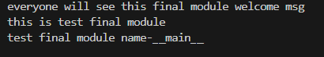

## HI __name__ == '__main__'
1. Effective method calling from another `python.py ` file.
2. For example: `Final_module.py` and `test_final_module.py` two different python file . <br>
`Final_module.py`
```
print("everyone will see this final module welcome msg")

def main():
    print("final  module is running name-{}".format(__name__))

if __name__=='__main__':
    main()
```
```

import Final_module
print('this is test final module ')
print("test final module name-{}".format(__name__))

```
running `test_final_module.py`


<br>
running `Final_module.py`

