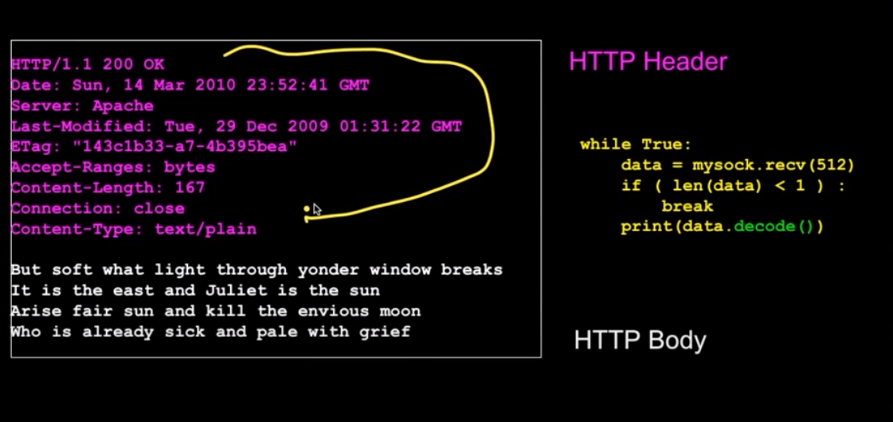
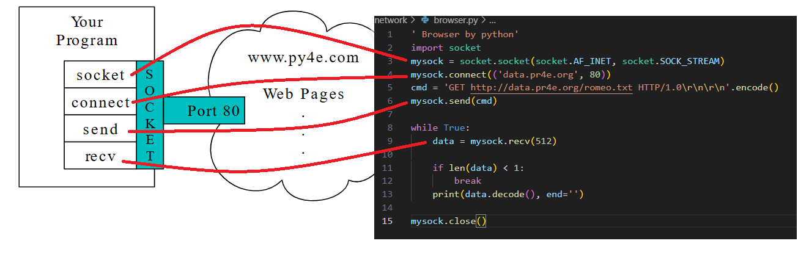

```
' Browser by python'
import socket
import importlib
socket = importlib.import_module('socket')
# mysock = socket(socket.AF_INET,socket.SOCK_STREAM)
mysock = socket.socket(socket.AF_INET, socket.SOCK_STREAM)
mysock.connect(('data.pr4e.org', 80))
cmd = 'GET /romeo.txt HTTP/1.0\r\n\r\n'.encode()
mysock.send(cmd)

while True:
    data = mysock.recv(512)
    if len(data) < 1:
        break
    print(data.decode(), end='')

mysock.close()
```

